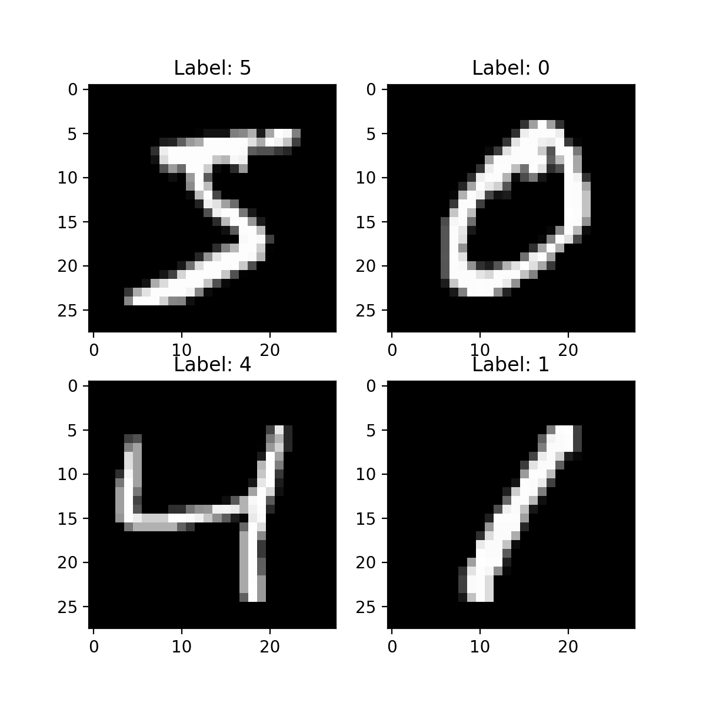
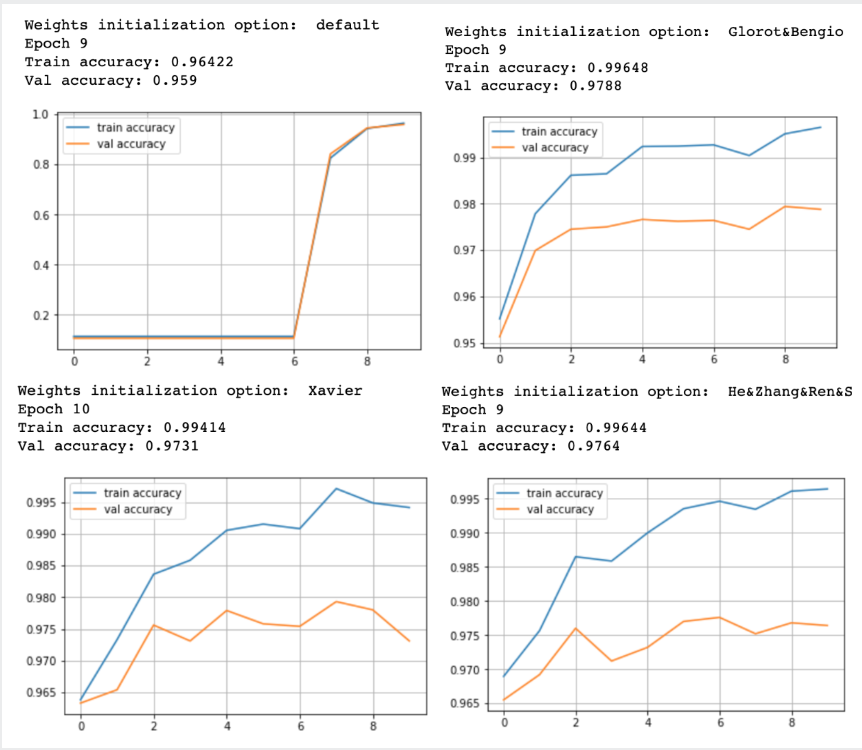
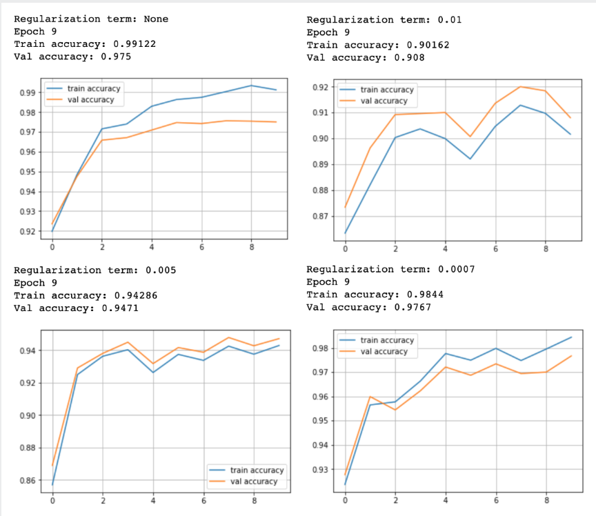

# My own neural network
> My own implementation of a dense neural network successfully trained on MNIST Dataset. We implemented and compared different features for our neural network.

## Installation & Usage

OS X & Linux:

```sh
sudo apt install virtualenv
virtualenv -p python3 env
source env/bin/activate
pip3 install -r requirements.txt
python3 main.py
```

## Implemented features

* Layer: Dense
* Activation function: ReLu
* Weights initializer: Random Normal, Xavier, Glorot&amp;Bengio, He&amp;Zhang&amp;Ren&amp;Sun
* Optimizer: SGD, SGD with momentum, Nesterov AGD, RMSProp, AdaGrad, Adam
* Regularization: L2
* Drop out: No
* Batch normalization: No

## Dataset used

* The MNIST DATABASE of handwritten digits



## Results

In the following we compare results obtained with different **weights initialization methods** and different parameters for **L2 regularization**.

### Weights Initialization

<p align="center"> 

</p>

### L2 Regularization

<p align="center"> 

</p>
