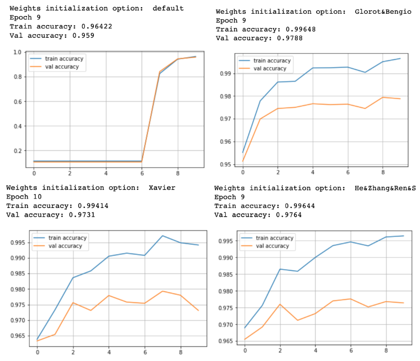
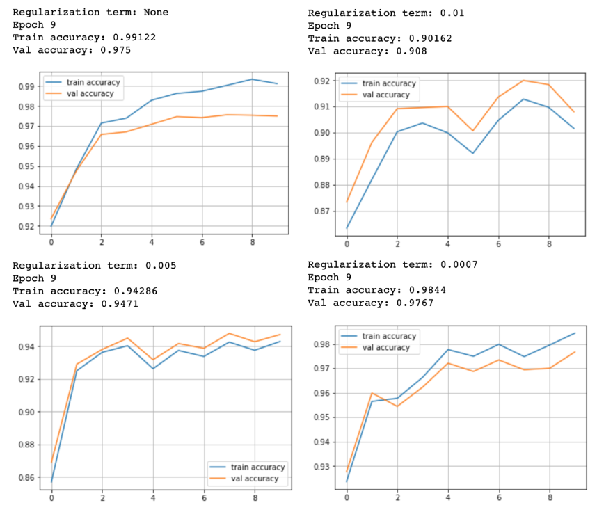

# My own neural network
> My own implementation of a dense neural network successfully trained on MNIST Dataset. We implemented and compared different features for our neural network.

## Installation & Usage

OS X & Linux:

```sh
sudo apt install virtualenv
virtualenv -p python3 env
source env/bin/activate
pip3 install -r requirements.txt
python3 main.py
```

## Implemented features

* Layer: Dense
* Activation function: ReLu
* Weights initializer: Random Normal, Xavier, Glorot&amp;Bengio, He&amp;Zhang&amp;Ren&amp;Sun
* Optimizer: SGD, SGD with momentum, Nesterov AGD, RMSProp, AdaGrad, Adam
* Regularization: L2
* Drop out: No
* Batch normalization: No

## Dataset used

* The MNIST DATABASE of handwritten digits


## Results

In the following we compare results obtained with different **weights initialization methods** and different parameters for **L2 regularization**. We used SGD as optimization method, on 9 epochs with batch size of 32.

### Weights Initialization

We compared the following weights initialization methods:
* random normal distribution (default)
* Glorot&Bengio initialization
* Xavier initialization
* He&Zhang&Ren&Sun initialization

<p align="center"> 

</p>

**Conclusion:**

- We observe that Xavier, Glorot&Bengio and He&Zhang&Ren&Sun methods worked better than the default initialization since with the 3 methods we had convergence at the first epoch while it took 7 epochs to converge with the default initialization.

These methods indeed help to preserve the variance of the flow through the network, preventing early vanishing or exploding gradients.

- He&Zhang&Ren&Sun gave us the better initialization which was expected since this method is the adapted version of Xavier initialization for non linear activations producing sparsity like ReLu function which we used.

### L2 Regularization

We compared the following L2 regularization parameters:
* "\\lambda" = 0
*

<p align="center"> 

</p>

**Conclusion:**

- We obsverve that WITH a regularization term the gap between train and val accuracy is lower (<0.7%) than WITHOUT a regularization term (1.6%). Therefore the introduction of a regularization reduces overfitting.

- We could achieve a better validation accuracy with a regularization term of 0.0007 (97.67%) than without (97.5%).
